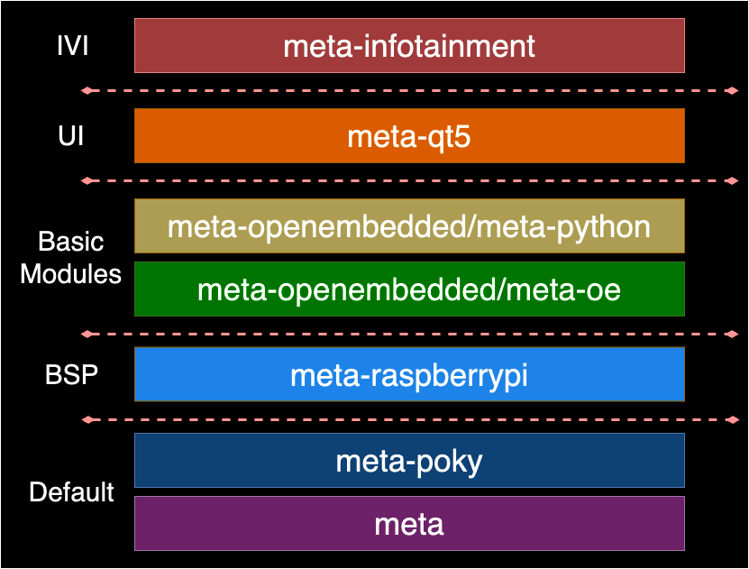

# meta-infotainment

This is the layer for **In-Vehicle Infotainment** fit in OpenEmbedded/Yocto

Details of **In-Vehicle Infotainment**, go to In [In-Vehicle-Infotainment](https://github.com/SEA-ME-COSS/In-Vehicle-Infotainment)

# Dependencies

This layer depends on:

- URI: [https://github.com/yoctoproject/poky](https://github.com/yoctoproject/poky)
    - branch : kirkstone
    - revision : 4.0.12
- URI: [git://git.openembedded.org/meta-openembedded](https://git.openembedded.org/meta-openembedded//)
    - branch : kirkstone
    - commit : 8a75c61cce2aa1d6e5a3597ab8fc5a7ee6aeae1e4
- URI: [https://github.com/agherzan/meta-raspberrypi](https://github.com/agherzan/meta-raspberrypi.git)
    - branch : master
    - commit : 59a6a1b5dd1e21189adec49c61eae04ed3e70338
- URI: [https://github.com/meta-qt5/meta-qt5](https://github.com/meta-qt5/meta-qt5.git)
    - branch : kirkstone
    - commit : ae8a97f79364bed1abc297636f7933d0e35f22be

# Quick Start

Install basic environment for yocto.

```
sudo apt-get update
```

```
sudo apt-get upgrade -y
```

```
sudo apt install -y bmap-tools zstd liblz4-tool gawk wget git-core diffstat unzip texinfo gcc-multilib build-essential chrpath socat libsdl1.2-dev xterm python
sudo apt install -y curl

```

Install the [repo](https://source.android.com/docs/setup/download/downloading?hl=ko#installing-repo) command by Google first.

```
mkdir -p ~/bin
curl https://storage.googleapis.com/git-repo-downloads/repo > ~/bin/repo
chmod a+x ~/bin/repo
export PATH=~/bin:$PATH

```

## Create workspace

```
mkdir yocto-infotainment && cd yocto-infotainment
repo init -u https://github.com/SEA-ME-COSS/meta-infotainment -b kirkstone -m tools/ivi-yocto.xml
repo sync
repo start work --all

```

## Setup Build Environment

```
cd poky
. ./meta-infotainment/setup.sh

```

# Build Images

This headunit works fully on Raspberry Pi 4 with full hardware setup.

```
bitbake infotainment-rpi-image

```

# Download Image

1. Find where SD card is
    
    ```
    sudo fdisk -l

    ```
    
2. Write image to SD card
    
    You should write rpi-sdimg.
    
    ```
    cd tmp/deploy/images/raspberrypi4-64
    sudo dd if=infotainment-rpi-image-raspberrypi4-64-[timewhenyoubuild].rootfs.rpi-sdimg of=/dev/sda
    sync

    ```
    

# Architecture



# Details

1. recipes-connectivity & recipes kernel
    - Files for match poky(kirkstone) and meta-rapsberrypi(master)
    - Refer meta-raspberrypi [issue #1211](https://github.com/agherzan/meta-raspberrypi/issues/1211)
2. recipes-env
    - Basic setting for run our ivi app
    - Install qt5, wifi, raspi-config etc
3. recipes-ipc
    - Module for IPC(vsomeip)
    - We have to downgrade boost version for particular version of commonapi
4. recipes-pypi
    - Install piracer and dependent pip packages
    - Use setuptools3
5. recipes-module
    - Apps that we made. Including headunit & ivi
    - Supervisor is for auto start and managing the process
6. recipes-core
    - Main bb files for making our image

# References

- [Yocto Project](https://docs.yoctoproject.org/4.0.12/migration-guides/migration-4.0.html)
- [Meta-raspberrypi](https://meta-raspberrypi.readthedocs.io/en/latest/index.html)
- [Meta-Qt](https://koansoftware.com/pub/talks/QtDay-2019/QtDay2019-Koan.pdf)
- [Meta-Openembedded](https://layers.openembedded.org/layerindex/branch/master/layers/)
